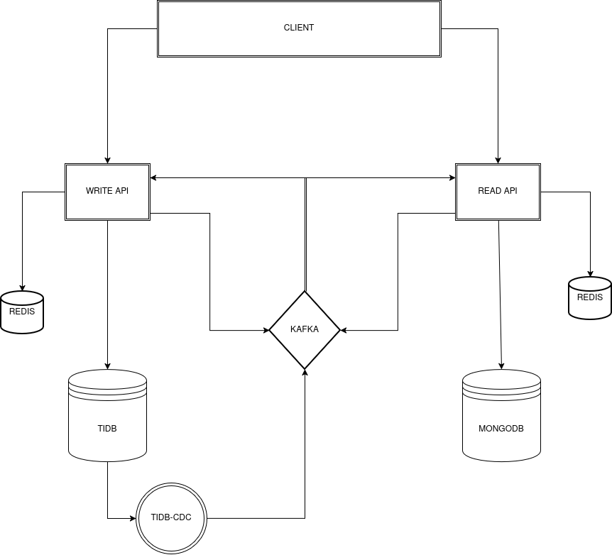

# URL Shortener

A distributed URL shortening platform built with **Java and Spring Boot**, designed to explore real-world backend engineering concepts such as **CQRS, Change Data Capture (CDC), event-driven communication, polyglot persistence, distributed databases, caching, observability, and containerized infrastructure**.



---

## About the Project

This project is more than a traditional URL shortener.

The main goal is to explore how a backend system can evolve from a simple CRUD application into a **distributed, observable, event-driven system** capable of separating workloads, asynchronously propagating data changes, and using different technologies according to each component's requirements.

The project uses a **write-oriented application**, a dedicated **read API**, and a **notification service**, connected through a CDC and event-driven pipeline.

The system combines:

* **Java 25**
* **Spring Boot**
* **CQRS**
* **Change Data Capture**
* **TiDB**
* **TiKV**
* **TiFlash**
* **TiCDC**
* **Apache Kafka**
* **MongoDB**
* **Dragonfly**
* **OpenTelemetry**
* **Grafana**
* **Prometheus / VictoriaMetrics**
* **Loki**
* **Tempo**
* **Grafana Alloy**
* **Docker Compose**
* **Kubernetes**
* **Argo CD**
* **Jenkins**

The infrastructure is intentionally close to what could be found in a production-oriented distributed backend environment.

---

## Main Idea

The application follows an event-driven data flow:

```text
Client
  │
  ▼
Write Application
  │
  ▼
TiDB
  │
  ▼
TiCDC
  │
  ▼
Kafka
  │
  ├──────────────► Read API
  │                    │
  │                    ▼
  │                 MongoDB
  │                    │
  │                    ▼
  │                 Dragonfly
  │
  └──────────────► Notification Service
```

The transactional database remains responsible for the application's source data, while database changes are propagated asynchronously through **CDC**.

This allows other components to react to changes without requiring the write application to synchronously coordinate every downstream operation.

---

## Architecture

The system is based on a few important architectural ideas:

### CQRS

The project separates **write operations** from **read operations**.

The write side is optimized around transactional consistency and persistence, while the read side maintains its own representation of the data optimized for queries.

### Change Data Capture

Instead of explicitly publishing an event every time the application modifies the database, **TiCDC observes database changes** and propagates them to Kafka.

This makes the database changes themselves the source of events for downstream consumers.

### Event-Driven Architecture

Kafka acts as the communication layer between independent components.

This allows consumers to process events asynchronously and independently from the application that generated the original database change.

### Polyglot Persistence

Different storage technologies are used according to their responsibilities:

| Technology | Responsibility                         |
| ---------- | -------------------------------------- |
| TiDB       | Transactional relational database      |
| TiKV       | Distributed storage layer used by TiDB |
| TiFlash    | Analytical storage layer               |
| MongoDB    | Read-side persistence                  |
| Dragonfly  | Cache                                  |
| Kafka      | Event streaming                        |

---

# Technology Stack

## Backend

* **Java 25**
* **Spring Boot**
* **Spring Web**
* **Spring Actuator**
* **jOOQ**
* **Flyway**
* **JUnit**
* **Mockito**
* **Testcontainers**

## Databases & Storage

* **TiDB**
* **TiKV**
* **TiFlash**
* **MongoDB 7**
* **Dragonfly**

## Messaging & Streaming

* **Apache Kafka**
* **TiCDC**
* **AKHQ**
* **KMinion**
* **Kafka JMX Exporter**

## Observability

The project includes a complete observability stack based on **OpenTelemetry** and Grafana components.

* **OpenTelemetry**
* **Grafana Alloy**
* **Grafana**
* **Prometheus / VictoriaMetrics**
* **Loki**
* **Tempo**
* **cAdvisor**
* **Node Exporter**
* **MongoDB Exporter**
* **Redis Exporter**
* **Kafka JMX Exporter**
* **KMinion**

This allows the application and infrastructure to be monitored through:

* Metrics
* Logs
* Distributed traces
* Infrastructure metrics
* Kafka metrics
* Database metrics

---

# Infrastructure

The complete development environment is containerized using **Docker Compose**.

The Compose environment includes the application services as well as the infrastructure required to run the complete distributed system.

### Application services

* Write application
* Read API
* Notification service

### Database infrastructure

* TiDB
* TiKV
* TiFlash
* MongoDB Replica Set
* Dragonfly

### Event infrastructure

* Kafka
* TiCDC
* AKHQ
* Kafka exporters

### Observability infrastructure

* Grafana
* VictoriaMetrics
* Loki
* Tempo
* Grafana Alloy
* cAdvisor
* Node Exporter
* MongoDB Exporter
* Redis Exporter

---

# Observability

Observability is treated as part of the system rather than an external addition.

The applications export telemetry using **OpenTelemetry**, while Grafana Alloy is responsible for collecting and forwarding telemetry to the observability stack.

The project supports the three main observability signals:

```text
                 ┌──────────────────┐
                 │    Applications  │
                 └────────┬─────────┘
                          │
                  OpenTelemetry
                          │
                          ▼
                 ┌──────────────────┐
                 │   Grafana Alloy  │
                 └──────┬────┬──────┘
                        │    │
              ┌─────────┘    └─────────┐
              ▼                         ▼
           Tempo                       Loki
         Traces                        Logs
              │                         │
              └──────────┬──────────────┘
                         ▼
                      Grafana
                         ▲
                         │
                    Metrics
                         │
                  VictoriaMetrics
```

This makes it possible to correlate application behavior with infrastructure metrics and distributed traces.

---

# Distributed Database

One of the main experimental aspects of the project is the use of **TiDB** instead of a traditional single-node relational database.

The environment runs:

```text
                    TiDB
                      │
              ┌───────┴───────┐
              │               │
             PD              TiKV
                              │
                         Distributed
                           Storage
```

TiDB provides a MySQL-compatible SQL interface while using TiKV as its distributed storage layer.

The project also includes TiFlash to explore the analytical side of the TiDB ecosystem.

---

# Change Data Capture

The project uses **TiCDC** to capture changes occurring in TiDB.

The resulting pipeline is:

```text
TiDB
  │
  ▼
TiCDC
  │
  ▼
Kafka
  │
  ├──► Read API
  │
  └──► Notification Service
```

This allows database changes to become asynchronous events consumed by independent services.

The CDC infrastructure is automatically configured through the scripts under:

```text
tidb/
└── changefeed-setup.sh
```

---

# MongoDB Read Model

The read side uses MongoDB as its persistence layer.

The environment also runs MongoDB as a **Replica Set**, providing a more realistic distributed database setup than a single standalone MongoDB instance.

```text
MongoDB Replica Set

       ┌─────────────┐
       │   Primary   │
       └──────┬──────┘
              │
              ▼
       ┌─────────────┐
       │   Secondary │
       └─────────────┘
```

The read model is populated asynchronously from the event stream.

This allows the read side to be optimized independently from the transactional database.

---

# Caching

The project uses **Dragonfly** as its cache layer.

Dragonfly provides a Redis-compatible interface while allowing the project to explore a modern high-performance in-memory data store.

The cache is also integrated into the observability stack through a Redis-compatible exporter.

---

# Testing

Testing is part of each application module.

The project uses:

* **JUnit**
* **Mockito**
* **Spring Boot Test**
* **Testcontainers**

Testcontainers allows integration tests to execute against real infrastructure instead of relying exclusively on mocks.

This is particularly useful for components that interact with:

* Databases
* Kafka
* MongoDB
* External infrastructure

---

# Containerization

Each application provides its own Dockerfile.

The root `docker-compose.yaml` orchestrates the complete environment.

```text
docker-compose.yaml
│
├── Applications
├── TiDB
├── TiKV
├── TiFlash
├── TiCDC
├── Kafka
├── MongoDB
├── Dragonfly
└── Observability Stack
```

All components communicate through the dedicated Docker network:

```text
url_shot_java
```

---

# Kubernetes

The repository also contains Kubernetes-related infrastructure under:

```text
k8s/
├── argo/
├── db/
└── jenkins/
```

The goal is to experiment with deploying the system beyond the local Docker Compose environment and explore concepts such as:

* Kubernetes workloads
* Infrastructure configuration
* CI/CD
* GitOps
* Argo CD
* Jenkins

---

# Project Structure

```text
.
├── alloy/                 # Grafana Alloy configuration
├── api/                   # Read API application
├── demo/                  # Main/write-side application
├── notify/                # Notification service
├── docs/                  # Architecture documentation
├── grafana/               # Grafana provisioning
├── k8s/                   # Kubernetes infrastructure
├── mongo/                 # MongoDB initialization
├── monitoring/            # Monitoring exporters/configuration
├── prometheus/            # Metrics configuration
├── tempo/                 # Distributed tracing configuration
├── tidb/                  # TiDB and TiCDC configuration
└── docker-compose.yaml    # Complete local environment
```

Detailed documentation for each application is available in its respective directory.

---

# Running the Project

## Requirements

Make sure the following tools are installed:

* Docker
* Docker Compose
* Git

For local development of the Java applications:

* JDK 25
* Maven or the included Maven Wrapper

---

## Start the complete environment

Clone the repository:

```bash
git clone <repository-url>
cd url-shortener
```

Start the infrastructure:

```bash
docker compose up --build
```

The first startup may take some time because the environment initializes several distributed components and databases.

---

# Available Services

Once the environment is running, some of the main interfaces are available at:

| Service                      | Address                 |
| ---------------------------- | ----------------------- |
| Write/Demo API               | `http://localhost:8080` |
| Read API                     | `http://localhost:8888` |
| Grafana                      | `http://localhost:3000` |
| Prometheus / VictoriaMetrics | `http://localhost:9090` |
| AKHQ                         | `http://localhost:8081` |
| MongoDB                      | `localhost:27017`       |
| TiDB                         | `localhost:4000`        |
| Kafka                        | `localhost:9092`        |
| Dragonfly                    | `localhost:6379`        |

Some services are infrastructure components and are not intended to be accessed directly by end users.

---

# Monitoring

After starting the environment, Grafana can be used to inspect the system.

The monitoring stack allows observing:

* Application metrics
* JVM metrics
* Container metrics
* Kafka metrics
* MongoDB metrics
* Cache metrics
* Database metrics
* Distributed traces
* Application logs

The project therefore provides an environment where application behavior can be analyzed together with the infrastructure supporting it.

---

# What This Project Explores

The main purpose of the project is not simply shortening URLs.

It is an engineering exercise focused on understanding how different backend technologies and architectural patterns behave when combined into a distributed system.

The project explores:

* CQRS
* Event-driven architecture
* Change Data Capture
* Distributed SQL databases
* Distributed storage
* Asynchronous processing
* Kafka-based event streaming
* Polyglot persistence
* Read models
* Caching
* Database replication
* Observability
* Distributed tracing
* Metrics collection
* Centralized logging
* Containerization
* Kubernetes
* CI/CD
* GitOps

---

# Engineering Goals

The project was created to investigate questions such as:

* How can a transactional database become an event source?
* How can CDC be used instead of application-managed domain event publishing?
* How can read workloads be separated from write workloads?
* How can different databases be used for different responsibilities?
* How can asynchronous communication reduce coupling between services?
* How can distributed systems be observed and diagnosed?
* How can the same application environment be reproduced consistently with containers?
* How can a local development environment resemble a production-oriented distributed architecture?

The project intentionally combines these technologies to make those questions practical rather than purely theoretical.

---

# Documentation

Each major application contains its own documentation.

* `api/README.md` — Read API
* `demo/README.md` — Main application
* `notify/README.md` — Notification service

The architecture diagram and infrastructure configurations are maintained at the repository level.

---

# Status

This project is primarily an **engineering and architecture study**, continuously evolving as new technologies, patterns, and infrastructure components are evaluated.

The implementation may change as different approaches are benchmarked, replaced, or simplified.

---

# License

This project is intended for educational and experimental purposes.
