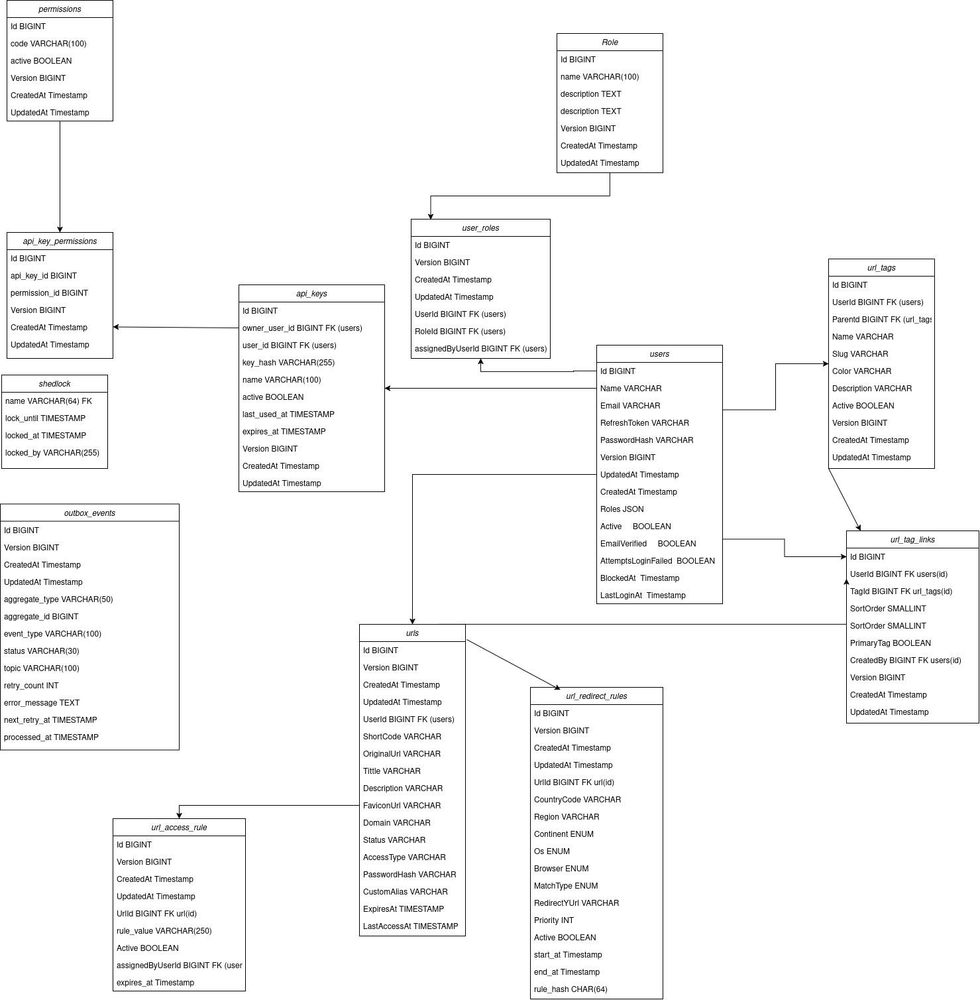

# URL Shortener — Write API

The **Write API** is the command-side application of a distributed URL Shortener platform, responsible for handling state-changing operations such as URL creation and updates, user management, API keys, roles, access rules, tags, and event publication.

The service was designed with a strong focus on **clean architecture, reliability, transactional consistency, asynchronous communication, and horizontal scalability**.

## Architecture

The application follows a combination of **Hexagonal Architecture** and **Domain-Driven Design (DDD)** principles.

The main layers are organized around business capabilities rather than framework-specific concerns:

```text
                    ┌──────────────────────┐
                    │      REST API        │
                    │   Inbound Adapter    │
                    └──────────┬───────────┘
                               │
                               ▼
                    ┌──────────────────────┐
                    │   Application Layer  │
                    │                      │
                    │  Use Cases / Services│
                    │  DTOs / Mappers      │
                    └──────────┬───────────┘
                               │
                               ▼
                    ┌──────────────────────┐
                    │    Domain Layer      │
                    │                      │
                    │ Models / Events       │
                    │ Business Rules        │
                    │ Value Objects         │
                    └──────────┬───────────┘
                               │
                    ┌──────────┴───────────┐
                    │                      │
                    ▼                      ▼
          ┌──────────────────┐   ┌──────────────────┐
          │ Persistence      │   │ Messaging        │
          │                  │   │                  │
          │ jOOQ / SQL       │   │ Kafka            │
          │ PostgreSQL       │   │ Outbox           │
          └──────────────────┘   └──────────────────┘
```

The application depends on **ports**, while infrastructure implementations are provided through adapters.

This keeps the business logic independent from persistence, messaging, HTTP, and framework-specific implementations.

---

## Main Features

### URL Management

* Create URLs
* Update URLs
* Soft delete URLs
* Force delete URLs
* Create URLs using API Keys
* URL access rules
* URL redirect rules
* URL tags and tag relationships
* QR Code support
* URL expiration and status management

### Authentication & Authorization

* User registration
* User authentication
* JWT-based authentication
* Refresh tokens
* Logout
* Email verification
* User blocking
* Role-based authorization
* API Key authentication
* API Key validation
* Permission-based access control

### Event-Driven Architecture

The application publishes domain events through an **Outbox Pattern** implementation.

Examples of events include:

* `UrlCreatedEvent`
* `UrlUpdatedEvent`
* `UrlDeleteEvent`
* `UserCreatedEvent`
* `UserDeletedEvent`
* `UserLoginSuccessEvent`
* `UserLoginFailEvent`
* `ApiKeyCreatedEvent`
* `ApiKeyDeletedEvent`
* `UrlAccessRuleCreatedEvent`
* `UrlRedirectRuleCreatedEvent`

Events are persisted together with the business transaction and published asynchronously to Kafka.

### Reliability

The messaging pipeline includes:

* Transactional Outbox
* Retry processing
* Failed-event recovery
* Dead Letter Queue (DLQ)
* Idempotent operations
* Database retry translation
* Circuit-breaker-aware exception handling
* Scheduled background jobs
* Distributed scheduling with ShedLock

---

# Transactional Outbox

One of the main architectural decisions in this service is the use of the **Transactional Outbox Pattern**.

Instead of updating the database and publishing directly to Kafka in the same application flow:

```text
Application
     │
     ▼
Database Transaction
     │
     ├── Business Data
     │
     └── Outbox Event
```

The event is first persisted in the same database transaction as the business operation.

A background publisher then processes pending events:

```text
┌──────────────┐
│ Application  │
└──────┬───────┘
       │
       ▼
┌───────────────────┐
│ Database          │
│                   │
│ Business Data     │
│ Outbox Events     │
└────────┬──────────┘
         │
         │ scheduled publisher
         ▼
┌───────────────────┐
│ Outbox Publisher  │
└────────┬──────────┘
         │
         ▼
      Kafka
         │
         ▼
   Other Services
```

This avoids the classic dual-write problem where the database transaction succeeds but message publication fails.

---

# Event Reliability

Failed messages are handled through retry and DLQ mechanisms.

```text
                ┌──────────────┐
                │ Outbox Event │
                └──────┬───────┘
                       │
                       ▼
                 ┌───────────┐
                 │ Publisher │
                 └─────┬─────┘
                       │
                 ┌─────▼─────┐
                 │   Kafka   │
                 └─────┬─────┘
                       │
                  failure
                       │
                       ▼
                 ┌───────────┐
                 │    DLQ    │
                 └─────┬─────┘
                       │
                       ▼
                Failure Handler
```

This allows failed events to be inspected and processed without silently losing messages.

---

# Idempotency

The API provides an idempotency mechanism for operations where duplicate requests could produce undesirable side effects.

The implementation is based on an application-level annotation:

```java
 @Idempotent
```

combined with an AOP-based interceptor.

This allows idempotency behavior to be applied declaratively to selected API operations without coupling the business logic to the implementation details.

---

# Persistence

The application uses **jOOQ** for database access.

Rather than relying on a traditional ORM abstraction, SQL access is explicitly modeled through repositories and generated jOOQ types.

The persistence layer is isolated behind repository ports:

```text
Application
     │
     ▼
IUrlRepository
     │
     ▼
JooqUrlRepository
     │
     ▼
jOOQ
     │
     ▼
Database
```

This keeps the application layer independent from jOOQ and the underlying database implementation.

Database schema evolution is handled with **Flyway** migrations.

---

# Caching

**Redis** is used as a caching infrastructure component.

The application provides a reusable Redis CRUD abstraction:

```text
Application
     │
     ▼
RedisCrudService
     │
     ▼
Redis
```

Caching is isolated inside the infrastructure layer, preventing the domain and application layers from depending directly on Redis.

---

# Security

The API uses **Spring Security** with JWT authentication.

The authentication flow is based on:

```text
Client
  │
  ▼
Authentication Endpoint
  │
  ▼
JWT Access Token
  │
  ▼
Protected API
  │
  ▼
Security Filter
  │
  ▼
User Principal
```

API Keys are also supported for programmatic access.

The service contains dedicated components for:

* JWT generation and validation
* Authentication filters
* User principals
* Access denied handling
* Authentication entry points
* API Key argument resolution
* CORS configuration
* Role-based authorization

---

# Distributed ID Generation

The application uses a **Snowflake-style ID generator** for distributed identifier generation.

This provides identifiers that can be generated independently by application instances without requiring a centralized sequence for every request.

The project also contains validation and utility components dedicated to Snowflake identifiers.

---

# Scheduling

Several operations are executed asynchronously through scheduled jobs.

Examples include:

* Publishing pending Outbox events
* Retrying failed Outbox events
* Processing failed events
* Removing expired URLs

**ShedLock** is used to coordinate scheduled tasks in distributed deployments and prevent multiple application instances from executing the same scheduled job simultaneously.

---

# Testing

The project contains unit and integration tests covering multiple layers of the application.

The test suite includes:

* Controller tests
* Application service tests
* Repository tests
* Outbox tests
* Kafka publisher tests
* Scheduler tests
* Authentication tests
* API Key tests
* URL management tests
* Access rule tests
* Redirect rule tests
* Tag tests
* User and role tests

**Testcontainers** is used for infrastructure-dependent integration tests.

This allows tests to execute against real infrastructure components instead of relying exclusively on mocks.

---

# Technology Stack

| Technology        | Purpose                          |
| ----------------- | -------------------------------- |
| Java              | Main programming language        |
| Spring Boot       | Application framework            |
| Spring Security   | Authentication and authorization |
| jOOQ              | Type-safe SQL / persistence      |
| PostgreSQL        | Relational database              |
| Flyway            | Database migrations              |
| Kafka             | Event streaming                  |
| Redis             | Caching                          |
| ShedLock          | Distributed scheduler locking    |
| Testcontainers    | Integration testing              |
| Docker            | Containerization                 |
| Jenkins           | CI/CD                            |
| Swagger / OpenAPI | API documentation                |
| Maven             | Build and dependency management  |

---

# Project Structure

The source code is organized around architectural boundaries:

```text
src/main/java/com/write/api
│
├── adapters
│   ├── in
│   │   └── web
│   │       └── controller
│   │
│   └── out
│       ├── messaging
│       └── persistence
│
├── application
│   ├── dto
│   ├── mapper
│   └── service
│
├── bootstrap
│
├── core
│   └── domain
│       ├── enums
│       ├── event
│       ├── exception
│       ├── model
│       ├── service
│       └── valueobject
│
├── infrastructure
│   ├── config
│   ├── exception
│   ├── messaging
│   └── scheduler
│
├── ports
│   ├── in
│   └── out
│
└── shared
```

The most important dependency direction is:

```text
Adapters → Application → Domain
                │
                ▼
              Ports
                ▲
                │
        Infrastructure
```

Infrastructure implementations depend on ports rather than the other way around.

---

# API Documentation

The project uses **OpenAPI / Swagger** for API documentation.

After starting the application, the API documentation can be accessed through the configured Swagger UI endpoint.

The project also contains dedicated documentation classes for controllers and response models to keep the API contract separate from controller implementation details.

---

# Database Schema

The database structure is documented through the migration module.



Database changes are versioned through Flyway migrations:

```text
V1  → Users
V2  → URL Tags
V3  → URLs
V4  → URL Links
V5  → URL Redirect Rules
V6  → Roles
V7  → User Roles
V8  → URL Access Rules
V9  → API Keys
V10 → Outbox Events
V11 → Permissions
V12 → API Key Permissions
V13 → ShedLock
```

---

# Running the Project

## Requirements

Before running the application, make sure the following are available:

* Java
* Maven
* Docker
* PostgreSQL
* Redis
* Kafka

For integration tests, Docker is required because Testcontainers manages the required infrastructure.

## Build

```bash
./mvnw clean package
```

or:

```bash
mvn clean package
```

## Run

```bash
./mvnw spring-boot:run
```

The application can also be executed using Docker.

```bash
docker build -t url-shortener-write-api .
```

---

# CI/CD

The repository contains a `Jenkinsfile` defining the project's CI/CD pipeline.

The pipeline can be used to automate:

```text
Build
  │
  ▼
Tests
  │
  ▼
Package
  │
  ▼
Docker Image
  │
  ▼
Deployment
```

---

# Architectural Patterns

This project intentionally combines several architectural and enterprise patterns:

* Hexagonal Architecture
* Domain-Driven Design
* Repository Pattern
* Use Case Pattern
* Transactional Outbox
* Event-Driven Architecture
* Idempotency
* Retry Pattern
* Dead Letter Queue
* Circuit Breaker
* Distributed Scheduling
* Dependency Inversion
* DTO / Mapper Pattern
* Soft Delete
* Snowflake ID Generation

The goal is not simply to implement a URL shortener, but to explore how a state-changing backend service can be designed for **reliability, maintainability, and distributed execution**.

---

# Design Goals

The main goals of the Write API are:

* Keep business logic independent from infrastructure
* Guarantee consistency between database state and emitted events
* Support asynchronous event-driven communication
* Handle message delivery failures safely
* Prevent duplicated operations
* Support horizontal scaling
* Keep persistence concerns isolated
* Provide strong automated test coverage
* Make architectural boundaries explicit
* Provide a foundation for a distributed URL Shortener platform

---

## Related Components

This service is part of a larger URL Shortener architecture.

The Write API is responsible for **commands and state changes**, while read-heavy workloads can be handled independently by the read side.

This separation enables the system to evolve toward a **CQRS-based architecture**, where write and read workloads can be optimized independently.
